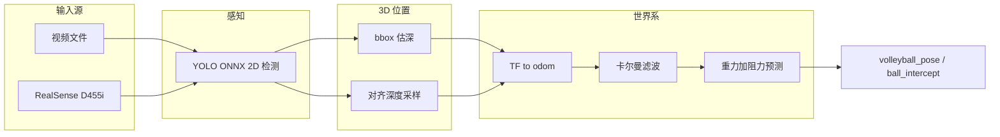
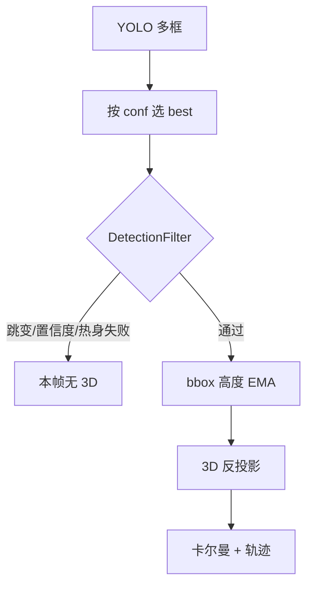
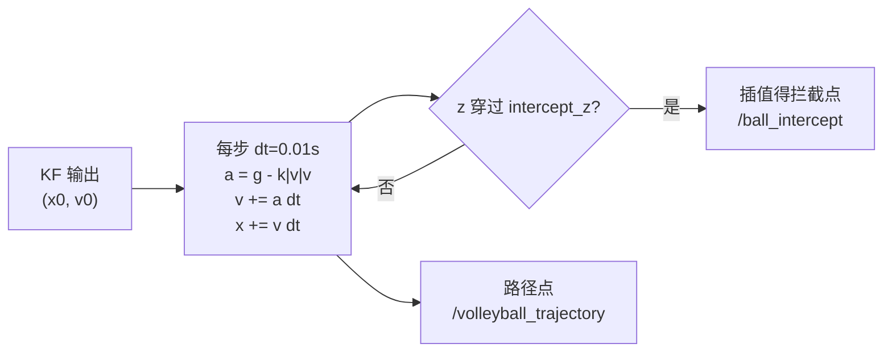
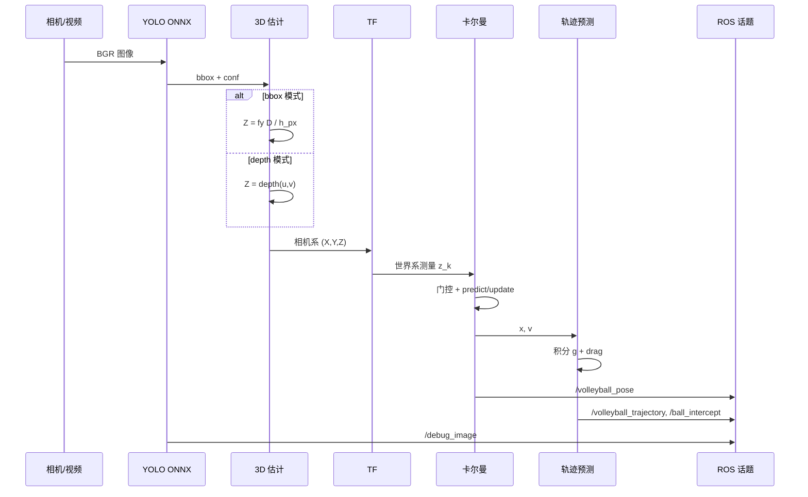

# 排球检测与落点预测（ROS2 Humble）

基于 **YOLOv8（ONNX）+ 卡尔曼滤波 + 物理轨迹预测** 的排球 3D 跟踪系统。  
一个 C++ 节点 `ball_detector_node` 同时支持 **视频 bbox 估深** 与 **RealSense RGB-D 深度** 两种 3D 方案，通过 launch / YAML 切换，无需改代码。


---

## 架构



### 三包分工（节点与通信）

| 包 | 节点 | 职责 |
|----|------|------|
| **`station_detector_cpp`** | `ball_detector_node`（+ RealSense / `video_publisher`） | 检测、深度、**TF→`base_link`**、KF；发 `/ball_intercept` |
| **`volleyball_executor`** | `intercept_bridge_node` | 收 `/ball_intercept` → 低轨道球面约束 → `/vision/stewart_target` |
| **`volleyball_msgs`** | （无 node，仅 `.msg`） | `StewartControl` 等消息类型，与 UC 对齐 |

```text
相机 → ball_detector_node → /ball_intercept
                              ↓
                    intercept_bridge_node → /vision/stewart_target
                              ↓
              UC volleyball_hub → /stewart_command → Stewart 电机
```

`volleyball_msgs` 不是节点，是**消息格式定义**（类似结构体声明）。联调步骤见 [INTEGRATION_CHECKLIST.md](src/volleyball_executor/docs/INTEGRATION_CHECKLIST.md)。

### 实现思路（概要）

| 阶段 | 做什么 |
|------|--------|
| **2D 检测** | OpenCV DNN 加载 ONNX，输出排球 bbox |
| **3D 位置** | **bbox**：针孔模型由框高估深；**depth**：对齐深度图中值采样 |
| **坐标变换** | 相机光学系 → `base_link`（静态 TF 占位，上机器人后实测标定） |
| **时序滤波** | 6 状态卡尔曼（位置+速度），丢帧预测、速度门控 |
| **轨迹预测** | 重力 + **二次空气阻力**，半隐式欧拉数值积分至落地 |

详细公式见下文 [方法论与数学模型](#方法论与数学模型)。

---

## 方法论与数学模型

> 公式使用 GitHub 支持的 `$...$` / `$$...$$` 语法。

整条链路可以写成：**像素观测 → 3D 测量 → 世界系滤波 → 物理外推**。下面按代码实际实现写（与 `trajectory_predictor.cpp`、`ball_tracker.cpp` 一致）。

### 1. 针孔相机与 3D 反投影

**bbox 模式**（`position.mode=bbox`）：假设排球直径 $D$ 已知，检测框像素高度 $h_\text{px}$ 与深度 $Z$ 成反比：

$$
Z = \frac{f_y \cdot D}{h_\text{px}}
$$

$$
X = \frac{(u - c_x)\,Z}{f_x}, \quad Y = \frac{(v - c_y)\,Z}{f_y}
$$

其中 $(u,v)$ 为框中心像素，$(f_x,f_y,c_x,c_y)$ 来自 `/camera_info`。  
框高经 EMA 平滑（`detection.h_ema_alpha`）以减轻抖动。

**depth 模式**（RealSense）：在 $(u,v)$ 处读对齐深度图 $Z$（16UC1 毫米或 32FC1 米，小 patch 取中值），再用上式反投影 $X,Y$。

对应参数：`volleyball.diameter`（默认 0.21 m）、`position.depth_min_m` / `depth_max_m`。

#### 1.1 2D 检测门控（进入 3D 之前）

YOLO 每帧可能出多个框或误检；`DetectionFilter` 在**像素平面**做门控，通过后才算 3D：

| 步骤 | 条件 | 失败时 |
|------|------|--------|
| 边界 | 框中心在图像内 | 丢弃 |
| 置信度 | `conf >= min_confidence` | 丢弃 |
| 跳变 | 与上一有效中心距离 $\le$ `max_jump_distance`（px） | reset 滤波器，丢弃（视频循环靠此恢复） |
| 热身 | 连续有效帧 $\ge$ `min_consistent_detections` | 丢弃 |

可选 `use_tracker: true` 时用 `MultiDetectionTracker` 在多框间做 IOU 关联（跳变阈值 ×1.5）。



实现：`detection_filter.cpp`、`ball_detector_node.cpp`（`updateBboxHeightEma`）。

---

### 2. 卡尔曼滤波（6 状态匀速模型）

状态向量（世界系 `odom`）：

$$
\mathbf{x} = [x,\; y,\; z,\; v_x,\; v_y,\; v_z]^\top \in \mathbb{R}^6
$$

#### 2.1 状态转移（预测步）

离散匀速（CV）模型，$\Delta t$ 取**相邻图像时间戳之差**（非固定帧率）：

$$
\mathbf{x}_{k|k-1} = \mathbf{F}\,\mathbf{x}_{k-1|k-1}
$$

$$
\mathbf{F} =
\begin{bmatrix}
1 & 0 & 0 & \Delta t & 0 & 0 \\
0 & 1 & 0 & 0 & \Delta t & 0 \\
0 & 0 & 1 & 0 & 0 & \Delta t \\
0 & 0 & 0 & 1 & 0 & 0 \\
0 & 0 & 0 & 0 & 1 & 0 \\
0 & 0 & 0 & 0 & 0 & 1
\end{bmatrix}
$$

协方差预测：

$$
\mathbf{P}_{k|k-1} = \mathbf{F}\,\mathbf{P}_{k-1|k-1}\,\mathbf{F}^\top + \mathbf{Q}
$$

代码中 $\mathbf{Q}$ 由 `kalman.process_noise`（记为 $\sigma_q$）构造：

$$
\mathbf{Q} = \sigma_q \cdot \mathrm{diag}(0.1,\,0.1,\,0.1,\,1,\,1,\,1)
$$

即：**位置过程噪声较小、速度过程噪声较大**（允许速度变化、位置相对平滑）。预测后还对 $\mathbf{P}$ 加小量单位阵（数值稳定）。

**丢帧时**：无新测量则只做预测步，不更新；`missing_frames` 超过 `kalman.max_missing_frames` 则 reset。

#### 2.2 观测与更新步

只观测 3D 位置 $\mathbf{z}_k = [x,y,z]^\top$，观测矩阵：

$$
\mathbf{H} = \begin{bmatrix} I_3 & 0_{3\times3} \end{bmatrix} \in \mathbb{R}^{3\times6}
$$

测量噪声 $\mathbf{R} = \sigma_r \cdot I_3$，$\sigma_r$ = `kalman.measurement_noise`。

标准 KF 更新：

$$
\mathbf{y}_k = \mathbf{z}_k - \mathbf{H}\mathbf{x}_{k|k-1} \quad \text{（新息）}
$$

$$
\mathbf{S}_k = \mathbf{H}\mathbf{P}_{k|k-1}\mathbf{H}^\top + \mathbf{R}
$$

$$
\mathbf{K}_k = \mathbf{P}_{k|k-1}\mathbf{H}^\top \mathbf{S}_k^{-1} \quad \text{（卡尔曼增益）}
$$

$$
\mathbf{x}_{k|k} = \mathbf{x}_{k|k-1} + \mathbf{K}_k \mathbf{y}_k
$$

$$
\mathbf{P}_{k|k} = (I - \mathbf{K}_k \mathbf{H})\,\mathbf{P}_{k|k-1}
$$

#### 2.3 初速度注入

第一次测量只初始化 $\mathbf{x}=[x,y,z,0,0,0]^\top$。**第二次**有效测量前，用有限差分估计初速：

$$
\mathbf{v}_0 \approx \frac{\mathbf{z}_k - \mathbf{z}_{k-1}}{\Delta t}
$$

写入状态后才开始正常 predict/update，避免轨迹预测从「静止球」出发。

#### 2.4 测量门控（进入 KF 之前）

| 门控 | 条件 | 参数 |
|------|------|------|
| 速度门控 | $\|\mathbf{z}_k - \mathbf{z}_{k-1}\| / \Delta t > v_\text{max}$ 则丢弃本帧测量 | `detection.max_physical_speed`（25 m/s） |
| 检测滤波 | 像素跳变过大 / 连续帧不足 / 置信度低 | `max_jump_distance`, `min_consistent_detections`, `min_confidence` |
| 视频循环 | 大跳变时 reset 整条跟踪链 | 自动 |

```mermaid
flowchart TD
  M[3D 测量 z_k] --> G{速度门控\n|dz/dt| <= v_max?}
  G -->|否| R[reset 跟踪]
  G -->|是| P[预测: x = F x, P = F P F' + Q]
  P --> U{有测量?}
  U -->|是| KF[更新: K, x += K y, P = I-KH P]
  U -->|否| MISS[missing_frames++]
  MISS -->|超阈值| R
  KF --> OUT["输出 x, v → 轨迹预测"]
```

**关键参数**：

| 参数 | 默认 | 作用 |
|------|------|------|
| `kalman.process_noise` $\sigma_q$ | 0.05 | $\mathbf{Q}$ 基准；↑ 更跟得上加速，↓ 更平滑 |
| `kalman.measurement_noise` $\sigma_r$ | 50.0 | $\mathbf{R}$；↑ 更不信检测抖动 |
| `kalman.initial_uncertainty` | 10.0 | 初始化 $\mathbf{P}$ 对角元 |
| `kalman.max_missing_frames` | 15 | 连续无测量 reset 阈值 |
| `detection.max_physical_speed` | 25 m/s | 测量门控速度上限 |

---

### 3. 轨迹预测：重力 + 二次阻力

这不是简单抛物线 $z = z_0 + v_z t - \tfrac{1}{2}gt^2$，而是带**速度平方量级阻力**的数值积分（与羽毛球/排球常用近似一致）。

**受力**：

$$
\mathbf{F}_\text{drag} = -\tfrac{1}{2}\,\rho\, C_d\, A\, \|\mathbf{v}\|\,\mathbf{v}
$$

其中：
- $\rho$ = `air_density`（默认 1.225 kg/m³，海平面空气密度）
- $C_d$ = `drag_coefficient`（默认 0.47，近似球体）
- $A = \pi (D/2)^2$ = `volleyball.diameter` 算出的投影面积
- $m$ = `volleyball.mass_kg`（默认 0.27 kg）

**加速度**（代码里合并为）：

$$
\mathbf{a} = \begin{bmatrix}0\\0\\-g\end{bmatrix} - k\,\|\mathbf{v}\|\,\mathbf{v},
\quad k = \frac{\tfrac{1}{2}\rho C_d A}{m}
$$

注意：$\|\mathbf{F}_\text{drag}\|$ 随 $\|\mathbf{v}\|^2$ 增长（方向与 $-\mathbf{v}$ 一致），低速时接近线性，高速时显著减速——**不是** Stokes 线性阻力 $\propto \mathbf{v}$。

**默认参数下的数量级**（$D=0.21$ m, $m=0.27$ kg, $\rho=1.225$, $C_d=0.47$）：

$$
A = \pi (D/2)^2 \approx 0.035\,\text{m}^2, \quad
k = \frac{0.5 \rho C_d A}{m} \approx 0.037\,\text{s}^{-1}
$$

| 球速 $\|\mathbf{v}\|$ | $\|a_\text{drag}\| \approx k\|\mathbf{v}\|^2$ | 与 $g=9.81$ 比较 |
|------------------------|------------------------------------------------|-------------------|
| 5 m/s | ~0.9 m/s² | 阻力较小，近似抛物线 |
| 10 m/s | ~3.7 m/s² | 与重力同量级，弧明显变「扁」 |
| 15 m/s | ~8.3 m/s² | 阻力 > 重力，强减速 |

**数值积分**（半隐式 Euler，步长 `trajectory.integration_dt` 默认 0.01 s）：

1. $\mathbf{a}_n = [0,\,0,\,-g]^\top - k\,\|\mathbf{v}_n\|\,\mathbf{v}_n$
2. $\mathbf{v}_{n+1} = \mathbf{v}_n + \mathbf{a}_n\,\Delta t$
3. $\mathbf{x}_{n+1} = \mathbf{x}_n + \mathbf{v}_{n+1}\,\Delta t$

循环直到轨迹**首次穿过** `trajectory.intercept_z`（击球高度；`intercept_crossing` 控制方向），对穿越时刻做**线性插值**。拦截失败时回退到 `ground_z` 地面落点。



**与无阻力抛物线的区别**：无阻力时 $x(t), y(t)$ 线性、$z(t)$ 二次；有阻力时三轴都非线性，且水平速度也会衰减（$v_x, v_y$ 被 drag 拉低）。

**输出**（完整字段见下表 §输出话题）：
- **`/ball_intercept`**：给小车规划用（位置 + 相对/绝对到达时间 + 速度）
- `/volleyball_trajectory`：RViz 抛物线
- `/ball_prediction`：兼容旧下游（无 header；优先拦截点，失败才地面落点）

**调参直觉**：
- 击球高度 → `trajectory.intercept_z`
- 落点偏远、弧太「抛」→ **增大** `drag_coefficient`
- 3D 深度系统性偏差 → 调 `volleyball.diameter`（bbox）或检查 depth 量程
- 轨迹抖 → 先调 KF（`measurement_noise`、`h_ema_alpha`），再调阻力

---

### 4. 坐标系约定（当前：固定相机 + base_link）

| 帧 | 含义 |
|----|------|
| `camera_color_optical_frame` | RealSense 光学系（+Z 朝前，+Y 向下） |
| **`base_link`** | **底座系**（`world_frame_id`）；相机刚性固定于底盘/立杆 |

**当前工控部署**：launch 用 **static TF** 发布 `base_link → camera_link`（标定一次）。球位输出在 **`base_link`**，Stewart 指令同系。

```bash
ros2 launch station_detector_cpp yolo.launch.py pipeline_mode:=realsense use_static_camera_tf:=true
# 标定：改 yolo.launch.py 中 static TF 的 x,y,z,rpy
```

`trajectory.enable: false` 时 `/ball_intercept` 为 **实时跟踪**（当前球位 + 球速），非弹道 intercept。

---

### 4.1 历史方案（odom / 里程计，暂不使用）

若恢复移动底盘 + 场地固定系，可改 `world_frame_id: odom` 并接 `odom→base_link` TF（见 git 历史）。

---

### 5. 日志：「有框无 3D」

若 YOLO 出框但深度无效（误检、深度为 0、TF 失败），旧版会刷 `PARADOX` ERROR。  
现已改为 **DEBUG** 级别：正常运行不刷屏；排查时：

```bash
ros2 run station_detector_cpp ball_detector_node --ros-args --log-level debug
```

这在 RealSense 前景点无球、误检圆形物体时**是预期行为**，不是系统崩溃。

---

### 6. 端到端数据流（单帧）



**单帧延迟瓶颈**：YOLO 推理（PC+CUDA 约 6–8 Hz pose）；KF 与轨迹积分相对可忽略。

---

### 7. 公式 ↔ 源码对照

| 模块 | 文件 | 关键符号 / 逻辑 |
|------|------|-----------------|
| YOLO 推理 | `src/station_detector_cpp/src/yolo_inference.cpp` | ONNX、CUDA/CPU 回退 |
| 2D 门控 | `src/station_detector_cpp/src/detection_filter.cpp` | `max_jump_distance`, `min_consistent_detections` |
| bbox 估深 | `src/station_detector_cpp/include/ball_position_estimator.hpp` | $Z = f_y D / h_\text{px}$ |
| depth 采样 | 同上 + `ball_detector_node.cpp` | patch 中值、量程裁剪 |
| 卡尔曼 | `src/station_detector_cpp/src/ball_tracker.cpp` | $\mathbf{F}, \mathbf{H}, \mathbf{Q}, \mathbf{R}$，初速注入 |
| 速度门控 | `ball_detector_node.cpp` | `max_physical_speed` |
| 轨迹积分 | `src/station_detector_cpp/src/trajectory_predictor.cpp` | $k$、半隐式 Euler、落地插值 |
| 参数 | `src/station_detector_cpp/config/ball_detector_params_*.yaml` | 按 video / realsense 切换 |

---

## 快速开始

### 1. 编译

```bash
cd ~/volleyball_detection
source /opt/ros/humble/setup.bash
colcon build --symlink-install
source install/setup.bash
```

模型放到 `src/station_detector_cpp/model/best.onnx`（不提交 git）。

### 2. 启动（视频模式）

```bash
./start_all.sh
```

打开 **检测 launch + RViz**（看 `/debug_image` 和轨迹，不用 rqt）。

### 3. RealSense 深度模式

```bash
bash scripts/install_realsense_deps.sh   # 首次
# config/pipeline.conf → USE_REALSENSE=true
./start_all.sh
```

### 4. 停止

```bash
./stop_all.sh
```

---

## 两种 3D 方案

**改 `config/pipeline.conf` 即可，然后 `./start_all.sh`：**

```bash
USE_REALSENSE=false    # 视频 + bbox 估深
USE_REALSENSE=true     # RealSense D455i + 深度
YOLO_DEVICE=cpu        # 工控机无显卡用 cpu；有 NVIDIA 可 cuda
YOLO_INPUT_SIZE=416    # 1260P CPU 建议 416 + best_416.onnx
```

| | **video** | **realsense** |
|--|-----------|---------------|
| 配置 | `USE_REALSENSE=false` | `USE_REALSENSE=true` |
| YAML | `ball_detector_params_video.yaml` | `ball_detector_params_realsense.yaml`（416 用 `..._realsense_416.yaml`） |
| 3D 模式 | `position.mode: bbox` | `position.mode: depth` |
| 状态 | ✅ 已验证 | ✅ 工控机 CPU@416 已跑通 |

工控机改 C++ 后在本机编译：`bash scripts/rebuild_ipc.sh`（勿只拷开发机 `install/`）。

---

## 仓库结构

```
volleyball_detection/
├── config/pipeline.conf           # USE_REALSENSE / YOLO_DEVICE / YOLO_INPUT_SIZE
├── start_all.sh                 # 视觉 + RViz（不含 executor / UC）
├── stop_all.sh
├── run.sh                       # 免手敲 source 跑 ros2 命令
├── config/volleyball_debug.rviz # debug 图 + 3D 球点 Marker
├── scripts/
│   ├── install_realsense_deps.sh
│   ├── rebuild_ipc.sh           # 工控机本地 colcon（避免坏 symlink）
│   ├── rebuild_vision_opencv411.sh
│   └── rebuild_cv_bridge_opencv411.sh
└── src/
    ├── station_detector_cpp/      # 视觉：YOLO、深度、KF、/ball_intercept
    ├── volleyball_msgs/           # StewartControl（与 UC 一致）
    └── volleyball_executor/       # /ball_intercept → /vision/stewart_target
```

RealSense 驱动通过 apt 安装（`scripts/install_realsense_deps.sh`），不在本仓库内 vendoring。

**三包分工**：视觉 → 桥接 → Universal Controllers `volleyball_hub`：

```bash
./start_all.sh
ros2 launch volleyball_executor executor.launch.py   # 第二终端
```

桥接发 **`/vision/stewart_target`**（`volleyball_msgs/StewartControl`），**不要**直连 `/stewart_command`。

---

## 环境变量

在 `config/pipeline.conf` 里改（推荐），或命令行临时覆盖：

```bash
USE_REALSENSE=false|true
YOLO_DEVICE=auto|cpu|cuda
YOLO_INPUT_SIZE=640|416
VIDEO_PATH=...    MODEL_PATH=...    FRAME_RATE=15.0
```

`start_all.sh` 在无 `nvidia-smi` 时自动 `YOLO_DEVICE=cpu`；`YOLO_INPUT_SIZE=416` 时自动选 `best_416.onnx` 与 416 yaml。

---

## 输出话题

> **`.msg` 文件**（如 `msg/VolleyballIntercept.msg`）是 ROS2 **消息类型定义**，编译进代码，供 `ros2 topic echo` 和小车订阅——**不是** Markdown 文档，也不能删掉。  
> 字段含义以本表为准；调参见 [readme.md](src/station_detector_cpp/readme.md)。

| 话题 | 类型 | 下游用途 |
|------|------|----------|
| **`/ball_intercept`** | `station_detector_cpp/VolleyballIntercept` | **主输出**（`trajectory.enable:false` 时为实时球位+球速） |
| `/vision/stewart_target` | `volleyball_msgs/StewartControl` | **桥接输出** → UC `volleyball_hub` |
| `/volleyball_pose` | `geometry_msgs/PoseStamped` | KF 滤波后当前 3D 位姿（`base_link`） |
| `/volleyball_ball_marker` | `visualization_msgs/Marker` | RViz 3D 红点（KF 有效时） |
| `/volleyball_trajectory` | `visualization_msgs/MarkerArray` | RViz 预测轨迹（默认关闭） |
| `/debug_image` | `sensor_msgs/Image` | 检测框叠加（默认 ~12Hz 限频） |
| `/ball_prediction` | `geometry_msgs/Point` | **兼容**旧接口 |
| `/ball_state` | `geometry_msgs/Point` | 调试：当前位置 |

**yaml 拦截高度**（`ball_detector_params_*.yaml`）：

```yaml
trajectory:
  intercept_z: 1.0              # 击球机构高度 [m]，world Z
  intercept_crossing: descending  # descending | ascending | next
  ground_z: 0.0                 # 拦截失败时回退地面
```

小车侧：`剩余时间 ≈ event_time - now()`，目标 `(position.x, position.y)`。

---

## 文档

- [README.md](README.md) — 架构、**方法论与数学模型**、快速开始
- [INTEGRATION_CHECKLIST.md](src/volleyball_executor/docs/INTEGRATION_CHECKLIST.md) — **视觉→UC 联调清单**
- [DEBUGGING.md](src/station_detector_cpp/docs/DEBUGGING.md) — 分层排查
- [DEPLOYMENT.md](src/station_detector_cpp/docs/DEPLOYMENT.md) — CUDA / RealSense / 1260P·EtherCAT / 无显卡优化
- [CALIBRATION.md](src/volleyball_executor/docs/CALIBRATION.md) — 相机 TF、低轨道球心/R
- [MODEL_TRAINING_BRIEF.md](src/station_detector_cpp/docs/MODEL_TRAINING_BRIEF.md) — **给队友的练模型需求单**
- [readme.md](src/station_detector_cpp/readme.md) — **参数调优速查**（现象 → 旋钮）

---

## 进度与后续

**已完成：** 视频/RealSense 链路、KF、YOLO@416 CPU、RViz 3D 球点、debug 限频、executor 桥接、工控机编译脚本

**待做：**

1. `camera_link` / 低轨道球心 **实测标定**（见 CALIBRATION.md）
2. 与 UC 联调：`executor.launch.py` + CH7 视觉模式
3. fps 进一步优化：OpenVINO（可选）
4. 下游完整击球时序与颠球对接

---

## 迁移到机器人上位机

代码（git clone）可直接拷过去，但**环境要重做一遍**。主控可能是 **Jetson** 或 **1260P x86 工控机**（EtherCAT），详见 [DEPLOYMENT.md §五–§六](src/station_detector_cpp/docs/DEPLOYMENT.md#五机器人整机架构ethercat--1260p--颠球)。

| 步骤 | 开发机（4060） | 比赛机（Jetson） | 比赛机（1260P，无独显） |
|------|----------------|------------------|-------------------------|
| ROS2 Humble | 已有 | Jetson 文档 | 工控机 Ubuntu |
| `colcon build` | 已有 | **aarch64 重编** | **x86_64 重编**（与 4060 同架构） |
| YOLO 推理 | OpenCV CUDA | TensorRT / CUDA | **CPU 或 OpenVINO**；建议 YOLOv8n @416 |
| ONNX 模型 | 拷贝 `best.onnx` | 同左 | 同左（小模型需重训，见 DEPLOYMENT §6.2） |
| RealSense | `install_realsense_deps.sh` | 板子上再跑 | 同左 |
| TensorRT engine | 4060 的 **不能** 给 Jetson | Jetson 本机转 | 无 NVIDIA 则不用 |
| 与机构通信 | — | 订阅 `/ball_intercept` | 常作控制机；视觉可另设专机 |

**不用重写的**：算法、YAML、launch、`/volleyball_pose` 话题接口。  
**必须重做的**：编译、推理后端、相机驱动、真实 TF、与队友对齐 EtherCAT/颠球时序。
