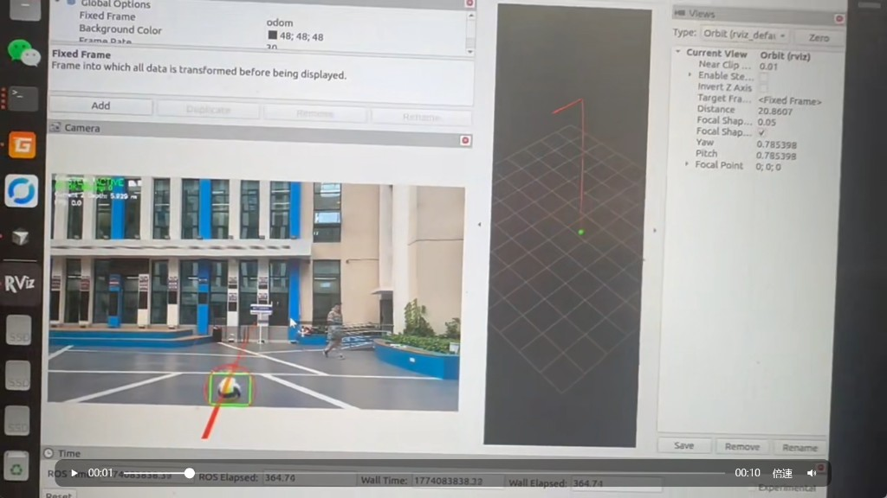

# 排球检测与落点预测（ROS2 Humble）

基于 **YOLOv8（ONNX）+ 卡尔曼滤波 + 物理轨迹预测** 的排球 3D 跟踪系统。  
一个 C++ 节点 `ball_detector_node` 同时支持 **视频 bbox 估深** 与 **RealSense RGB-D 深度** 两种 3D 方案，通过 launch / YAML 切换，无需改代码。



---

## 架构


### 实现思路

| 阶段 | 做什么 |
|------|--------|
| **2D 检测** | OpenCV DNN 加载 ONNX，输出排球 bbox |
| **3D 位置** | **bbox**：`Z ≈ 焦距 × 球直径 / 框高`；**depth**：框中心读对齐深度 |
| **坐标变换** | 相机光学系 → `odom`（静态 TF 占位，上机器人后换 URDF） |
| **时序滤波** | 6 状态卡尔曼，丢帧预测、速度门控、视频循环自动 reset |
| **轨迹预测** | 重力 + 空气阻力积分，输出落点与时间 |

---

## 快速开始

### 1. 编译

```bash
cd ~/volleyball_detection
source /opt/ros/humble/setup.bash
colcon build --symlink-install
source install/setup.bash
```

模型放到 `src/station_detector_cpp/model/best.onnx`（不提交 git）。

### 2. 启动（视频模式）

```bash
./start_all.sh
```

打开 **检测 launch + RViz**（看 `/debug_image` 和轨迹，不用 rqt）。

### 3. RealSense 深度模式

```bash
bash scripts/install_realsense_deps.sh   # 首次
PIPELINE_MODE=realsense ./start_all.sh
```

### 4. 停止

```bash
./stop_all.sh
```

---

## 两种 3D 方案

**改 `config/pipeline.conf` 即可，然后 `./start_all.sh`：**

```bash
USE_REALSENSE=false    # 视频 + bbox 估深
USE_REALSENSE=true     # RealSense D455i + 深度
YOLO_DEVICE=cuda       # GPU 推理
```

| | **video** | **realsense** |
|--|-----------|---------------|
| 配置 | `USE_REALSENSE=false` | `USE_REALSENSE=true` |
| YAML | `ball_detector_params_video.yaml` | `ball_detector_params_realsense.yaml` |
| 状态 | 已验证 | 待 D455i 实测 |

命令行仍可临时覆盖：`YOLO_DEVICE=cpu ./start_all.sh`

---

## 仓库结构

```
volleyball_detection/
├── start_all.sh                 # PIPELINE_MODE=video|realsense
├── start_realsense.sh           # 别名
├── config/volleyball_debug.rviz
├── scripts/install_realsense_deps.sh
└── src/
    ├── station_detector_cpp/    # 主包
    ├── realsense2_camera/       # 驱动源码（或 apt）
    └── mindvision_camera/       # 未用可忽略
```

---

## 环境变量

在 `config/pipeline.conf` 里改（推荐），或命令行临时覆盖：

```bash
USE_REALSENSE=false|true
YOLO_DEVICE=auto|cpu|cuda
VIDEO_PATH=...    MODEL_PATH=...    FRAME_RATE=15.0
```

---

## 输出话题

| 话题 | 说明 |
|------|------|
| `/debug_image` | RViz 看这个 |
| `/volleyball_pose` | 3D 位姿 |
| `/volleyball_trajectory` | 抛物线 Marker |
| `/ball_prediction` | 落点 + 时间 |

---

## 文档

- [DEBUGGING.md](src/station_detector_cpp/docs/DEBUGGING.md) — 分层排查
- [DEPLOYMENT.md](src/station_detector_cpp/docs/DEPLOYMENT.md) — CUDA / RealSense / Jetson
- [readme.md](src/station_detector_cpp/readme.md) — 参数调优

---

## 进度与后续

**已完成：** 视频链路、bbox 估深、KF、轨迹、CUDA 可选、统一模式切换、RViz 可视化

**待做：**

1. RealSense D455i 实机 — `PIPELINE_MODE=realsense ./start_all.sh`
2. 替换占位 static TF → 机器人 URDF / 标定
3. Jetson 部署 + TensorRT
4. fps 优化（可选，当前 PC 约 6–8 Hz pose）
5. 下游机构对接 `/volleyball_pose`

建议：**先插 D455i 测 depth，再上 Jetson。**

---

## 迁移到机器人上位机

代码（git clone）可直接拷过去，但**环境要重做一遍**：

| 步骤 | 开发机（4060） | 机器人（Jetson 等） |
|------|----------------|---------------------|
| ROS2 Humble | 已有 | 按 Jetson 文档装 |
| `colcon build` | 已有 | **必须重编**（架构不同） |
| OpenCV CUDA | `/usr/local` 自编译 | JetPack 自带，或板子上重编 |
| ONNX 模型 | 拷贝 `best.onnx` | 同左 |
| RealSense 驱动 | `install_realsense_deps.sh` | 板子上再跑一遍 |
| TensorRT | 4060 的 engine **不能**给 Jetson 用 | 需在 Jetson 本机转 engine |
| `pipeline.conf` | `USE_REALSENSE=true` | 同左，改 TF/标定后上机 |

**不用重写的**：算法代码、YAML 参数、launch 逻辑。  
**必须重做的**：编译、CUDA/OpenCV、TensorRT、相机驱动、真实 TF 标定。
